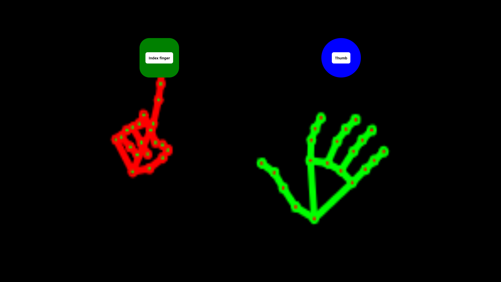

# Prototype Hands & Face_mesh @mediapipe in ReactJs Typescript

## Available Scripts

In the project directory, you can run:

### `npm install`

To install all the project's dependencies.

### `npm run start`

To boot the prototype, the prototype requires access to your webcam. 
